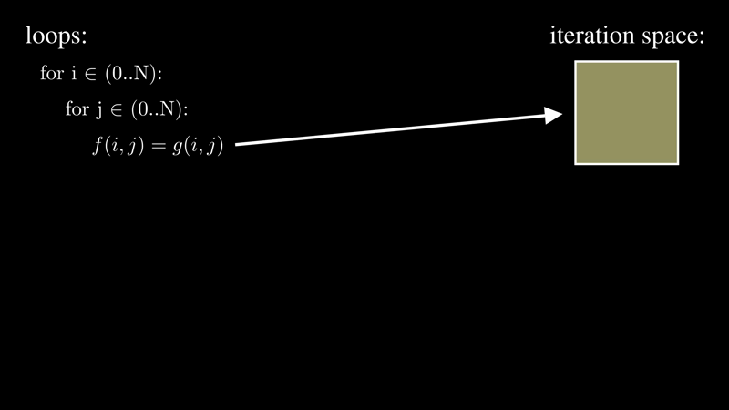

# Twoel generator for Halide

This is a Halide generator for the twoel() function in SCF.

# Goals

The main focus of this code is symmetry decomposition.  The generator uses
symmetry to minimize the number of times the g() function is called.

# Overall workflow

The main loop of twoel is encoded as a data structure, by the define_original_twoel() function.  This main-loop is then decomposed by the code in decompose.py into 6 sets of loops, covering a much smaller iteration space than the original.  1 of these loops is still 4-dimensional, but it covers ⅛ of the original iteration space.  The other 5 loops are 3-dimensional or less.

Once these sets of loops are calculated, a Halide algorithm is produced, scheduled, and compiled.

# Details

## twoel

The execution time of the SCF application is dominated by the `twoel()` function.

In pseudocode, the core loop of twoel looks like this:

```python
for i in 0..N:
  for j in 0..N:
    for k in 0..N:
      for l in 0..N:
        fock[i,j] += g(i,j,k,l) * dens[k,l]
        fock[i,k] += g(i,j,k,l) * dens[j,l] / -2
```

`N` is the problem size; it is 15 times the number of atoms being simulated.  `dens[]` is an input data structure.  `g()` is a function which is expensive to calculate.

`twoel()` is called by a convergence loop.  The initial contents of `fock[]` are the values produced by the previous round.

The implementation of `g()` is not listed here, but it is also part of the twoel algorithm.

## Loop nests

The core data structure is a LoopNest.  This represents a set of nested loops, the iteration space it covers, and the set of updates that occur in the innermost loop.

The original twoel() LoopNest looks like this:

```python
g = Function("g", ["i","j","k","l"])
zone = LoopNest(
    name="twoel",
    symmetries=[ (g, "i", "j"), (g, "k", "l"), (g, ["i","j"], ["k","l"]) ],
    updates=[
        Update(Function("fock", ["i","j"]), [g, Function("dens", ["k","l"])]),
        Update(Function("fock", ["i","k"]), [g, Function("dens", ["j","l"])], coeff=-0.5),
    ]
)
```


This loopnest covers a 4-dimensional iteration space.  It takes g() and d() as inputs, and writes output to f().

It has no conditions, so it covers the entire 4-dimensional rectangular prism.  It has 3 symmetries defined, which can be decomposed to reduce overall work.  There are 2 updates in the inner-most loop, which call the same g(), multiplied by different positions in d() with different coefficients, with the result added to different positions in f().

A decomposed LoopNest might look like this:

```python
g = Function("g", [i,i,k,k])
LoopNest(
  name='twoel_i_eq_j_k_eq_l_ij_lt_kl',
  conditions=[
    Condition([Index('i')], [Index('j')], '=='),
    Condition([Index('k')], [Index('l')], '=='),
    Condition([Index('i')], [Index('k')], '<')
  ],
  updates=[
    Update(Function('fock', [Index('i'), Index('i')]), [g, Function('dens', ['k', 'k'])]),
    Update(Function('fock', [Index('i'), Index('k')]), [g, Function('dens', ['i', 'k'])], coeff=-0.5),
    Update(Function('fock', [Index('k'), Index('i')]), [g, Function('dens', ['k', 'i'])], coeff=-0.5),
    Update(Function('fock', [Index('k'), Index('k')]), [g, Function('dens', ['i', 'i'])])
  ]
)
```

This decomposed loop-nest is 2-dimensional, with the condition `i < k`, so its iteration space is the lower triangle of a matrix.

## Decomposition

Symmetry decomposition is done in `decompose.py`.

Symmetry decomposition is accomplished by the following steps:

1. Identify a symmetry.  Example: g has the symmetry i == j, meaning `g(i,j)` is equal to `g(j,i)`.
1. Split the loop into 3 pieces.  call the pieces "upper", "equal", and "lower".  The loops are identical, except each of them has an added condition that constricts its iteration space.  The conditions are: `i < j` (upper), `i == j` (equal), `i > j` (lower).
1. Swap indexes `i` and `j` in the third loop, so that the condition is `i < j`.
1. Move the updates from "lower" into "upper".
1. Discard "lower".
1. Consolidate updates and conditions.
1. The new LoopNests take advantage of the Symmetry to do the same work, while covering less iteration space.

Here is a visual representation of that:



The Symmetry definitions act as a to-do list for the decomposition code.  The code recursively decomposes along the Symmetry definitions until none remain.

The `g()` function in twoel has 3 symmetries:

```python
symmetries=[ (g, "i", "j"), (g, "k", "l"), (g, ["i","j"], ["k","l"]) ],
```

Or, represented positionally:

```python
symmetries=[
    Symmetry(g, 0, 1),
    Symmetry(g, 2, 3),
    Symmetry(g, [0,1], [2,3]),
]
```

This means: `i = j`, `k = l`, and `(i,j) = (k,l)`.  They are internally expressed in terms of index-positions.  This representation is necessary to keep track of indexes through multiple decompositions without getting confused.

With these 3 symmetries, the original loop can be decomposed into 8 separate LoopNests, much like a truth table over 3 boolean values:

1. `i < j`, `k < l`, `(ij) < (kl)`
2. `i < j`, `k < l`, `(ij) = (kl)`, simplifies to 2D over `g(i,j,i,j)`, where `i < j`
3. `i < j`, `k = l`, `(ij) < (kl)`, simplifies to 3D over `g(i,j,k,k)`, where `i < j` and `(ij) < (kk)`
4. `i < j`, `k = l`, `(ij) = (kl)`, contradictory
5. `i = j`, `k < l`, `(ij) < (kl)`, simplifies to 3D over `g(i,i,k,l)`, where `k < l` and `(ii) < (kl)`
6. `i = j`, `k < l`, `(ij) = (kl)`, contradictory
7. `i = j`, `k = l`, `(ij) < (kl)`, simplifies to 2D over `g(i,i,k,k)`, where `i < k`
8. `i = j`, `k = l`, `(ij) = (kl)`, simplifies to 1D over `g(i,i,i,i)`

Two of these are contradictory and are detected as such, so the final decomposed LoopNest count is 6.

### Contradictory conditions

Loops #4 and #6 are contradictory.

* #4:
  * `(ij) = (kl)` implies `i = k` and `j = l`
  * `i = k`, `k = l`, `j = l` implies `i = j`
  * `i = j` and `i < j` cannot both be true
* #6:
  * `(ij) = (kl)` implies `i = k` and `j = l`
  * `i = k`, `i = j`, `j = l` implies `k = l`
  * `k = l` and `k < l` cannot both be true

Contradiction essentially means that the loop condition will never be true, and the LoopNest can be discarded entirely.  These contradictions result from the fact that the original symmetries are not completely independent of each other, they overlap.

The decomposition code detects these contradictions by performing symbolic execution with a small problem size, and comparing the results.  If the new set of LoopNests do not produce the same result as the previous LoopNest, the decomposition was invalid and is discarded.

This works well for twoel, because the the output function is 2-dimensional and the number of updates is relatively small.  This symbolic execution would have scalability problems in cases where the output functions have many indexes.  It may be possible to identify overlapping symmetries through direct logical analysis, before attempting to split, which would be more scalable in that case.

### Mergeable loops

Loops #3 and #5 are mirror images of each other:

* #3: `i < j`, `k = l`, `(ij) < (kl)`, simplifies to 3D over `g(i,j,k,k)`, where `i < j` and `(ij) < (kk)`
* #5: `i = j`, `k < l`, `(ij) < (kl)`, simplifies to 3D over `g(i,i,k,l)`, where `k < l` and `(ii) < (kl)`

It is possible to merge these two together, into a single loop with conditions `i = j`, `k < l`, `(ij) != (kl)`.  The logic to merge these is not implemented yet, as this is a lower dimensional loop.  Merging these loops could save around 3% of the total execution time.

## Generation

The file `twoel_gen.py` contains a Halide implementation of SCF's twoel function.  The symmetry decomposition, and generation of Halide funcs from the decomposed loops is done in `decompose.py`.

### algorithm

Each LoopNest is generated as a separate Halide `Func`.  Each Func has its own `RDom` to control the iteration space, and a set of updates.  The updates are all put into the same Func update, using `mux()` and `unroll()`, as described [here](https://github.com/halide/Halide/issues/5017#issuecomment-641586195).  This occurs in the `LoopNest.generate_halide()` method.

Finally, the result of each LoopNest is summed together to form the output Func.  This final summation occurs in the `DecomposedLoops.generate_halide()` method.

### schedule

For now, the schedule is baked into `twoel_gen.py` directly.  This schedule is a work in progress.

It is mostly focused on the 4D loopnest, as that is the bottleneck.  A simpler schedule is applied to the other loopnests.

The 4D schedule unrolls over `u`, which is the Update ID.  It uses `rfactor()` to create internal buffering across the `i` and `j` indexes.  It vectorizes over `i` and parallelizes over `j`.

#### scheduling TODO

Here are some things that can be improved, and ideas to try.

* I have attempted to produce tiles of `g()` at a time, but have not yet succeeded in doing this.
* Somehow, rfactor() sometimes increases the total amount of computation, beyond simple gathering of results at the end.  I don't understand why it does this.  An example of this is [here](https://github.com/halide/Halide/issues/5017#issuecomment-667421538).
* The current schedule with 1 thread is able to get within an order of magnitude of the serial C code (with symmetry but not schwarz negligibility checks).  However, increasing the thread count does not increase the performance.  It is probably possible to go faster.
* The schedule should be less embedded in the generation, and more accessible to end users in general.  It should be easy to try different scheduling directives, or generate a GPU version with a schedule suitable for GPUs.
* It is using too much memory for intermediate buffers.  the input problem size is greater than 15 atoms (120 basis functions), it allocates more than 4GB and Halide aborts.  It should be possible to compute a small hypercube of `g()` at a time, or one hypercube per thread, and fully consume it before moving on.  However, I haven't found a good, performant way to do that yet.
